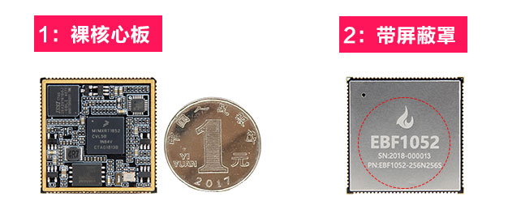
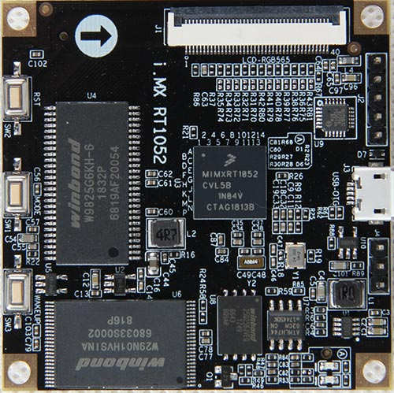
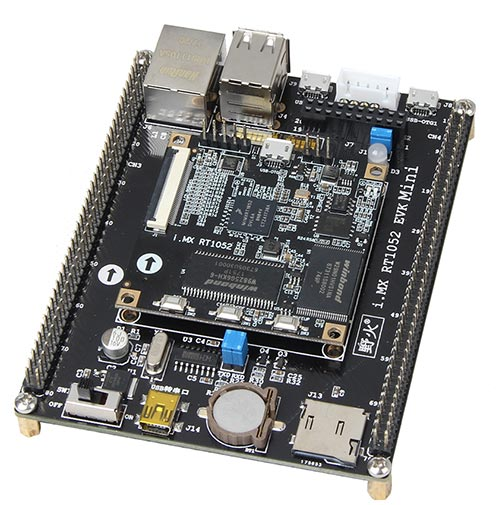
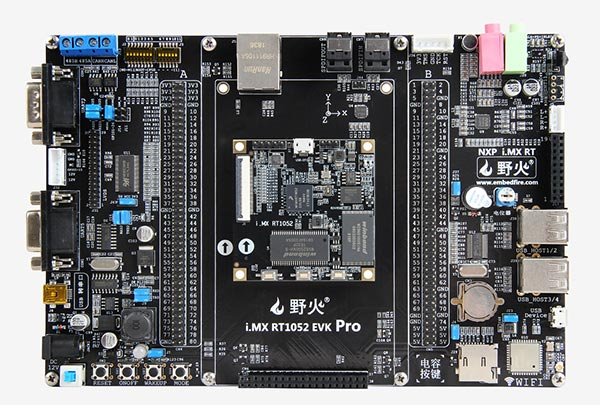

# 野火i.MX RT1052开发板

## 资料下载链接
* 野火i.MX RT1052开发板配套资料，适用于：

1. 【i.MX RT1052 邮票孔接口核心板】
2. 【i.MX RT1052 BTB接口核心板】
3. 【i.MX RT1052 Mini底板】
4. 【i.MX RT1052 Pro底板】
   
* 链接：<https://pan.baidu.com/s/1UscgNZ_Srj0BosjihvZSxA> 
* 提取码：to3d 

若以上链接失效，请使用以下链接：
* 链接：<https://pan.baidu.com/s/1CLMKL8JQ_gnYj1xRwlzx6A> 
* 提取码：xhwt 

## 产品图片

### i.MX RT1052 邮票孔接口核心板

### i.MX RT1052 BTB接口核心板

### i.MX RT1052 Mini板

### i.MX RT1052 Pro板

